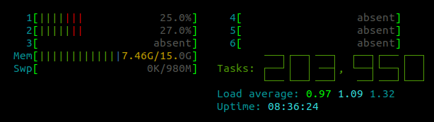
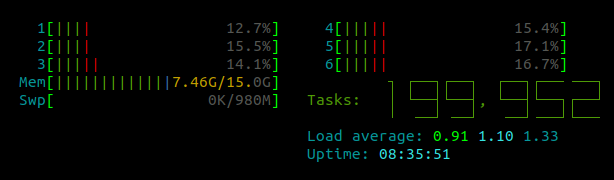

# cores
**cores** is a CLI utility for enabling and disabling CPU cores on Linux systems.
It eliminates the need to manually modify `/sys/devices/system/cpu/cpu<N>/online` or change BIOS settings.

## Quick example, a 6-core CPU

### 2 cores online, 4 cores offline
The following command sets 2 CPU cores online and the remaining 4  offline: 
```shell
# cores --set 2
```
`htop` shows 2 cores being online and 4 offline.


### 6 cores online
The following command brings all the CPU cores back online:
```shell
# cores --reset
```
`htop` shows all the 6 CPU cores being online.



## Installation

```shell
git clone git@github.com:dipdowel/cores.git
cd cores
cargo build --release
sudo cp ./target/release/cores /usr/local/bin
```
Then open a new terminal and run `cores --help` to verify the installation.


## Use cases
- Enable or disable individual CPU cores to manage power consumption or heat generation.
- Simulate a machine with fewer CPU cores for testing (e.g., to mimic an embedded system).
- Test multithreaded software by simulating core failures.
- View the current status of all CPU cores with a simple command.
- Output core states in JSON format for further automation.

## `cores --help`
```
$  cores --help
cores ― a convenience tool for enabling and disabling CPU cores on Linux systems.
- Run without parameters to see the current state of the CPU cores.
- Root privileges are needed to modify the state.
- Root privileges are used only for writing to `/sys/devices/system/cpu/cpuN/online`
- NB: On most systems core 0 is always online as it is essential for handling critical system interrupts,
  low-level kernel tasks, and managing system stability, so attempts to disable core 0 are ignored.


Usage:  cores <CORE_NUMBER> <on|off> [--json]
	cores --set <NUMBER> | --reset | --custom <RANGE> [--json]

Arguments:
  [CORE]   Specifies a core to set online or offline
  [STATE]  on | off - the state of the core to set

Options:
  -s, --set <NUMBER>       Set NUMBER of cores online and set all the other cores offline. Minimum value is 1 (core 0 is always online)
  -r, --reset              Enable all the cores of the system
  -c, --custom <CPU_LIST>  Use CPU list format (as in /sys/devices/system/cpu/online) to specify cores. E.g.: 0 | 0-5 | 1-3,5 | 0-2,4-5
  -j, --json               Print state of the cores in JSON format
  -h, --help               Print help

Examples:
   cores 2 on            Set core 2 online, other cores remain unchanged.
   cores 2 off           Set core 2 offline, other cores remain unchanged.
   cores -s 2            Set cores 0 and 1 online, set all the other cores offline.
   cores -s 3            Set cores 0, 1, 2, 3 online, set all the other cores offline.
   cores -c 1-3,5        Set cores 0, 1, 2, 3, 5 online, set all the other cores offline.
   cores -c 0-2,4-5      Set cores 0, 1, 2, 4, 5 online, set all the other cores offline.
   cores -c "0-2, 4-5"   Set cores 0, 1, 2, 4, 5 online, set all the other cores offline.

Feedback:
   - Bug reports: https://github.com/dipdowel/cores/issues
   - Suggestions: https://github.com/dipdowel/cores/discussions
```


## Root access
In order to enable or disable CPU cores, **cores** needs root access.
- If executed with `sudo`, root privileges are used **only** for writing to `/sys/devices/system/cpu/cpu<N>/online`,
all other operations are performed using UID of the original _sudoer_ (including parsing CLI arguments with `clap`).

## Limitations
- On most systems `core 0` is always online as it is essential for handling critical system interrupts, low-level kernel tasks, and managing system stability, so attempts to disable core 0 are ignored.
- `cores` currently works only on Linux-based systems.
